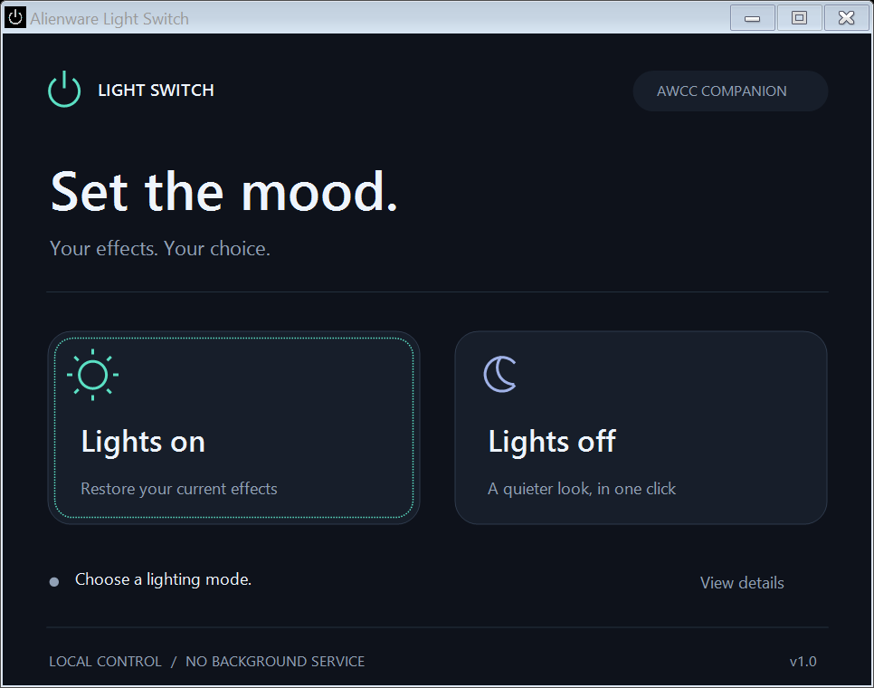

# Alienware Light Switch

A small, portable Windows app for turning Alienware lighting on or off through **Alienware Command Center (AWCC)**.



## Download

Download **AlienwareLightSwitch.exe** from the [latest release](https://github.com/RyanGosling0508/alienware-light-switch/releases/latest). It is the only file you need. No installer, administrator access, background service, or startup task is required.

1. Open the executable.
2. Choose **Lights on** or **Lights off**.
3. Wait for the status message. If AWCC is not running, the app requests a minimized launch, switches the lighting, then normally closes only that instance. An AWCC splash screen may still appear briefly. Your already-running AWCC window is not restored, minimized, or closed by the tool.

**Lights on** selects AWCC's **Go Light**, restoring your configured effects. **Lights off** selects **Go Dark**. The app does not change your fan profile or Windows power plan. Avoid interacting with AWCC while an operation is in progress.

## Does it work on every Alienware laptop?

**No universal compatibility claim is made.** This app automates AWCC's lighting controls; it does not implement a universal AlienFX hardware driver.

| Configuration | Status |
| --- | --- |
| Alienware 18 Area-51 AA18250, AWCC 6.14.20, Windows 11 x64 | Tested; keyboard and chassis off/on physically confirmed |
| Other systems with AWCC 6 and the same Go Light / Go Dark controls | May work; not yet validated |
| AWCC 5, systems without these controls, or substantially different AWCC layouts | Not supported by the current implementation |
| ARM Windows, Linux, macOS | Not tested / not supported |

The supported layout uses a **System Default** profile with the English accessible name. Different versions or UI languages can change accessibility identifiers and prevent operation. Lighting coverage, including power indicators and compatible connected peripherals, is determined by AWCC and the device. A game profile, AWCC update, or later settings change can override the selected mode.

Requires 64-bit Windows, .NET Framework 4.8, Windows PowerShell 5.1, and a working AWCC installation in its standard Program Files location. The tested OS is Windows 11; Windows 10 has not been validated. If your organization blocks PowerShell, the app may not work under that policy.

## How it works

The executable embeds a small PowerShell script as an assembly resource. It runs that script in a hidden child process and uses Windows UI Automation to navigate to:

`AWCC > Library > System Default > Go Light / Go Dark`

It reads back the selected AWCC radio button before reporting completion. There are no external script files to copy, and no direct USB writes, firmware edits, driver installation, or attempts to stop Dell services. The helper exits after each operation. A pre-existing AWCC process is never treated as owned by this app. For a process started by the tool, normal window closure is requested only after successful verification and after checking its process ID, start time, and executable path. If foreground activity indicates that you took over the AWCC window, automatic closure is skipped. No force termination or service changes are used. On errors, AWCC is left available for troubleshooting. This is best-effort window management, not a guarantee that AWCC will never show a splash screen or briefly activate itself. The tool still navigates AWCC lighting pages to perform the requested change.

An AWCC selection readback is **software confirmation**, not optical proof that every physical LED changed. Physical keyboard and chassis behavior has been confirmed on the tested machine; other configurations need their own verification.

The app itself makes no network requests. AWCC may use its own network services. Local diagnostic files are written to `%LOCALAPPDATA%\AlienwareLightSwitch`. **View details** shows errors; review and redact personal paths before sharing logs.

## Build from source

On 64-bit Windows with .NET Framework 4.8:

```powershell
powershell.exe -NoProfile -File .\build.ps1
```

Output: `dist\AlienwareLightSwitch.exe`. The build uses the Windows .NET Framework C# compiler and has no NuGet dependencies. `make-icon.ps1` can regenerate the included original icon.

The release executable is not code-signed. Release assets include a SHA-256 checksum; you can compare it with `Get-FileHash`. A checksum verifies file identity, not publisher authenticity.

### Validation

- Compiled the embedded-script executable successfully.
- Tested both visible buttons from a directory containing only the executable.
- Verified AWCC selection after off/on actions.
- Tested minimized AWCC startup, successful lighting changes, normal closure, and absence of an AWCC UI process afterward.
- Tested pre-existing normal and minimized AWCC windows: both retained their original window state and remained running.
- Checked the UI layout at the test machine's 150% display scaling.
- Physical off/on behavior was confirmed on the tested AA18250.

A diagnostic command is available for manual hardware testing:

```powershell
# These commands CHANGE the actual lighting.
.\dist\AlienwareLightSwitch.exe --verify Off
.\dist\AlienwareLightSwitch.exe --verify On
```

They exit with 0 only after the expected AWCC selection is read back. GUI applications may need `Start-Process -Wait -PassThru` to inspect the exit code in PowerShell.

## Troubleshooting

Version 1.0.3 reduces false user-takeover detection during AWCC startup. Input tracking starts when the owned window appears, and takeover detection also checks whether the pointer targets AWCC or a keyboard key is held. This remains best-effort: avoid using AWCC during a lighting change.

- Open AWCC manually and check that **Go Light** and **Go Dark** work.
- Complete any AWCC update or onboarding prompts before trying again.
- Use **View details** if the app cannot locate the expected controls.
- Do not run multiple lighting changes simultaneously.
- If AWCC changes its layout, please report your laptop model, AWCC version, Windows version, UI language, and a redacted error message in an issue.

## License and affiliation

MIT licensed. This is an independent project, not affiliated with or endorsed by Dell or Alienware. Alienware, AlienFX, and AWCC are trademarks of their respective owners.
